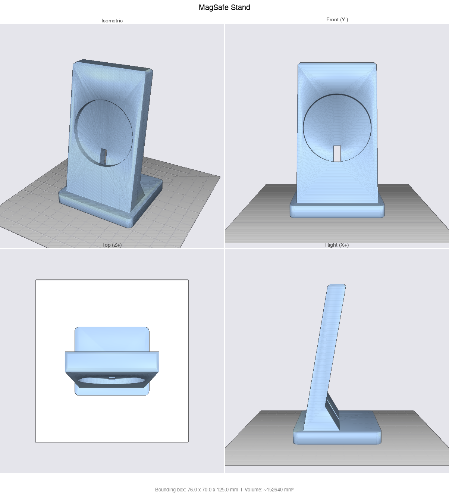
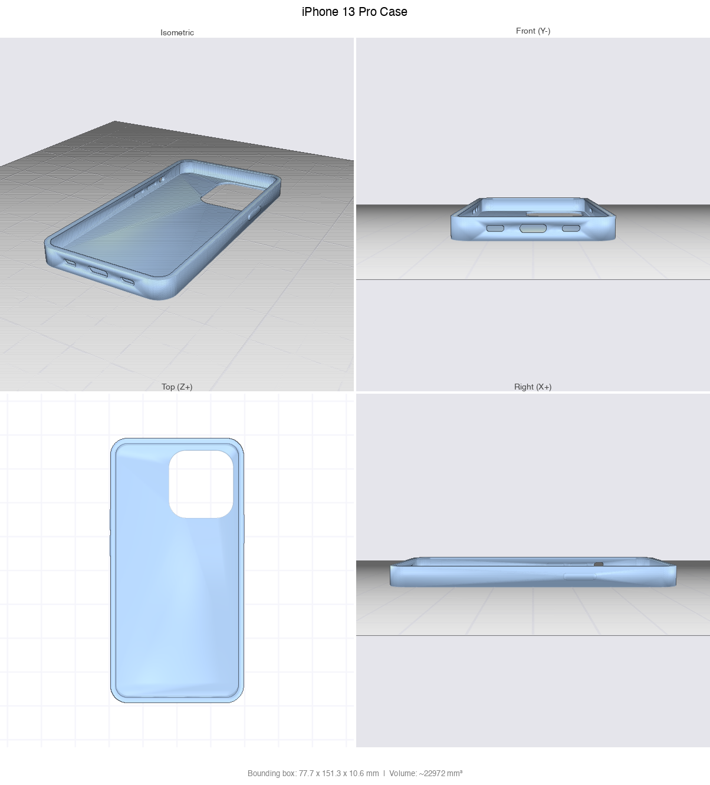
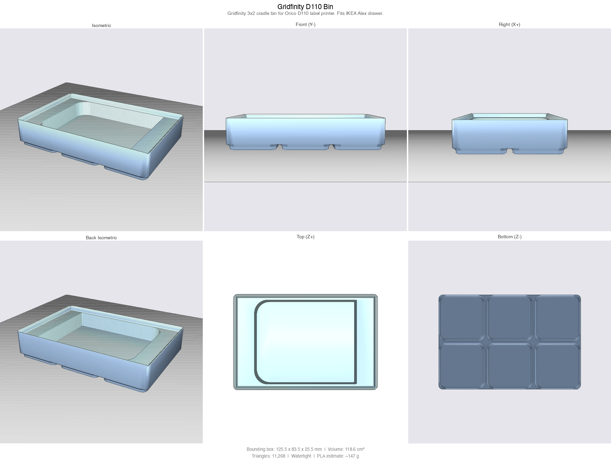
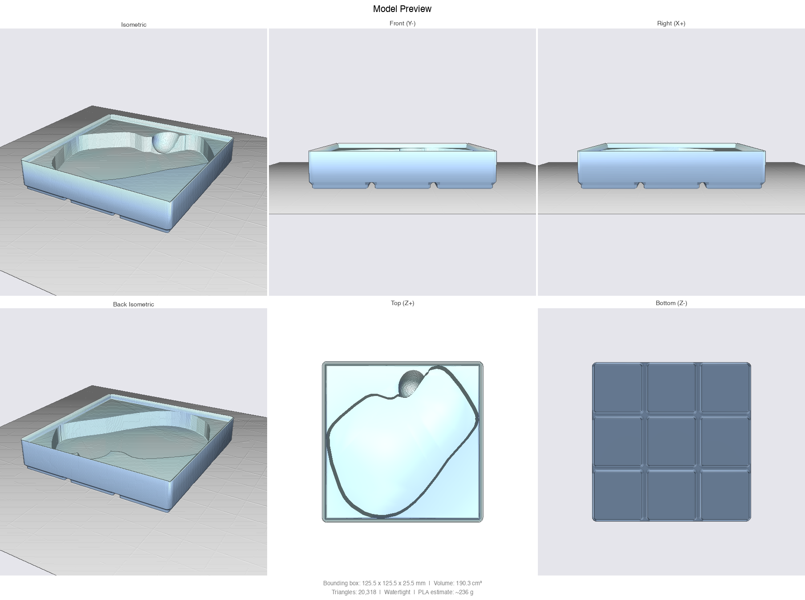
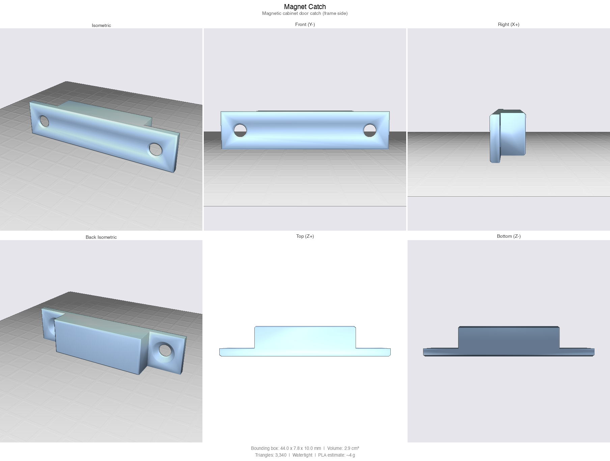
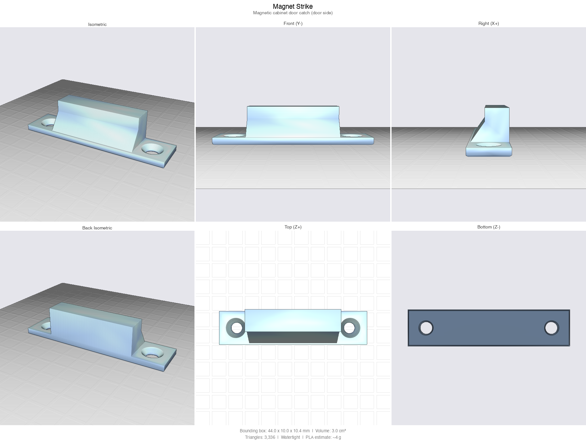

# CAD Skill for Claude Code

A [Claude Code](https://docs.anthropic.com/en/docs/claude-code) skill for generating parametric 3D-printable models using [CadQuery](https://cadquery.readthedocs.io/). Describe a physical object, and Claude will write a parametric script, export STL, render previews, and iterate with you until it's right.

<p align="center">
  
  
</p>

Read the full write-up: [I Taught Claude to Design 3D-Printable Parts. Here's How](https://medium.com/@nchourrout/i-taught-claude-to-design-3d-printable-parts-heres-how-675f644af78a)

## More examples

Published on [MakerWorld](https://makerworld.com/en/@sercanto).

<p align="center">
  
</p>

<p align="center">
  
</p>

The MX Master 3 bin above ([examples/mx_master3_bin_3x3.py](examples/mx_master3_bin_3x3.py), [printed and published on MakerWorld](https://makerworld.com/en/models/3049470-gridfinity-bin-for-logitech-mx-master-3-3x3)) shows the scan-to-pocket pipeline: `outline_from_scan.py` traces the mouse's real footprint from a 3D scan, the outline is rotated to the angle that minimizes its bounding square so the bin fits a 3x3 grid instead of 4x3, and a tilted thumb scoop ramps under the thumb rest to lift the mouse out.

<p align="center">
  
  
</p>

## Installation

```bash
mkdir -p ~/.claude/skills
git clone https://github.com/flowful-ai/cad-skill ~/.claude/skills/parametric-3d-printing
```

## Usage

Once installed, the skill activates in two ways inside Claude Code:

- **Auto-trigger.** Describe a part you want to print ("design a wall mount for an Arduino Uno", "I need a snap-fit lid for this box") and Claude picks up the skill from its trigger keywords (3D print, STL, CadQuery, enclosure, bracket, and so on).
- **Explicit slash command.** Type `/parametric-3d-printing` to invoke it directly, useful when your request does not contain the obvious keywords.

Claude will then walk you through requirements, build the model in phases (base shape, features, finish), and deliver an STL plus a rendered preview.

## Dependencies

Requires **Python 3.10-3.12** (CadQuery's OCC kernel does not have wheels for 3.13+):

```bash
python3.12 -m venv .venv && source .venv/bin/activate
pip install -r requirements.txt
```

## Files

| File | Purpose |
|------|---------|
| `SKILL.md` | Skill definition and workflow instructions for Claude |
| `gridfinity.py` | Tested Gridfinity bin generator (base profile, stacking lip, magnets, compartments, custom pockets). Vendored next to generated scripts. |
| `outline_from_scan.py` | Extracts a pocket outline from a 3D scan of an object (align, scale, slice, union), ready for `add_polygon_pocket`. |
| `examples/` | Model scripts built on the gridfinity module (D110 cradle, MX Master 3 diagonal bin). |
| `preview.py` | Headless STL to 6-view PNG renderer (trimesh + pyrender). Use `--strict` to fail on non-watertight meshes. |
| `run_cadquery_model.py` | Subprocess wrapper that runs a CadQuery script, captures errors, optionally renders the preview, and emits a JSON result so Claude can self-correct in a loop. |
| `mesh_io.py` | STL loading with validation (no pyrender dependency). Used by the wrapper and converter. |
| `stl_to_3mf.py` | Standalone STL to 3MF converter for Bambu Studio / PrusaSlicer. |
| `design-review.md` | Visual inspection checklist and printability analysis |
| `requirements.txt` | Pinned dependency versions |

## License

The skill and scripts are licensed under the [PolyForm Noncommercial License 1.0.0](LICENSE). Free to use, modify, and distribute for noncommercial purposes.

---

Created by [Nicolas Chourrout](https://github.com/nchourrout) from [Flowful.ai](https://flowful.ai)
