<p align="center">
  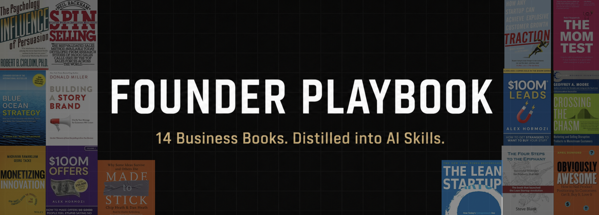
</p>

# Founder Playbook

14 proven business books, distilled into structured AI skills that any LLM can use. Each skill captures the frameworks, decision trees, case studies, and templates from a single book - the stuff that actually matters, without the 300 pages of anecdotes.

```bash
npx skills add getagentseal/founder-playbook
```

Built for [Claude Code](https://claude.ai/claude-code) (auto-triggers based on your question), but works with ChatGPT, Gemini, Cursor, or any LLM as reference docs.

## What's Inside

| Skill | Source | Use When |
|-------|--------|----------|
| **[diagnose](diagnose/SKILL.md)** | **Meta-skill (routes across all 14)** | **Don't know where to start, multiple problems, "nothing is working"** |
| [mom-test](mom-test/SKILL.md) | The Mom Test - Rob Fitzpatrick | Customer interviews, validating ideas without leading questions |
| [four-steps](four-steps/SKILL.md) | The Four Steps to the Epiphany - Steve Blank | Finding first customers, Customer Development, Market Type |
| [lean-startup](lean-startup/SKILL.md) | The Lean Startup - Eric Ries | Build-Measure-Learn, MVPs, pivots, innovation accounting |
| [obviously-awesome](obviously-awesome/SKILL.md) | Obviously Awesome - April Dunford | Positioning, category choice, competitive context |
| [crossing-the-chasm](crossing-the-chasm/SKILL.md) | Crossing the Chasm - Geoffrey Moore | Tech adoption, beachhead strategy, mainstream scaling |
| [blue-ocean-strategy](blue-ocean-strategy/SKILL.md) | Blue Ocean Strategy - Kim & Mauborgne | Category creation, escaping competition |
| [monetizing-innovation](monetizing-innovation/SKILL.md) | Monetizing Innovation - Ramanujam & Tacke | Pricing strategy, willingness-to-pay, product+price design |
| [spin-selling](spin-selling/SKILL.md) | SPIN Selling - Neil Rackham | B2B sales, complex deals, multi-stakeholder selling |
| [100m-offers](100m-offers/SKILL.md) | $100M Offers - Alex Hormozi | Offer design, packaging, making offers irresistible |
| [100m-leads](100m-leads/SKILL.md) | $100M Leads - Alex Hormozi | Lead generation, advertising, outbound and inbound strategy |
| [influence](influence/SKILL.md) | Influence - Robert Cialdini | Persuasion principles, negotiation, defense against manipulation |
| [traction](traction/SKILL.md) | Traction - Gabriel Weinberg & Justin Mares | Growth channels, Bullseye Framework, customer acquisition |
| [storybrand](storybrand/SKILL.md) | Building a StoryBrand - Donald Miller | Brand messaging, website copy, email campaigns, SB7 Framework |
| [made-to-stick](made-to-stick/SKILL.md) | Made to Stick - Chip & Dan Heath | Making messages memorable, pitches, presentations, SUCCESs Framework |

## Why This Exists

Business books have great frameworks buried in 300 pages of stories. You read the book, highlight 20 pages, and forget the frameworks six months later. These skills extract what matters:

- **Decision trees** - "Which framework applies to my situation?"
- **Frameworks** - The actual models, scored checklists, and step-by-step processes
- **Case studies** - Real companies that applied (or failed to apply) the ideas
- **Templates** - Fill-in-the-blank worksheets you can use immediately
- **Integration maps** - Where frameworks from different books conflict or complement each other

Each skill also includes an honest scope section: what the book got right, what's dated, and where it doesn't apply.

## How to Use

### Quick Install

```bash
npx skills add getagentseal/founder-playbook
```

### Manual Install

```bash
# Clone the repo
git clone https://github.com/getagentseal/founder-playbook.git

# Symlink into Claude's skills directory
for skill in founder-playbook/*/SKILL.md; do
  dir=$(dirname "$skill")
  name=$(basename "$dir")
  ln -sfn "$(pwd)/$dir" ~/.claude/skills/$name
done
```

Then just talk naturally. Claude reads the skill descriptions (~100 tokens each) and auto-loads the right one:

- *"What's wrong with my startup?"* - loads Diagnose (routes you to the right skill)
- *"I'm interviewing customers tomorrow"* - loads Mom Test
- *"Should we pivot?"* - loads Lean Startup
- *"Which marketing channel should we use?"* - loads Traction
- *"How do I price this?"* - loads Monetizing Innovation
- *"Our website doesn't convert"* - loads StoryBrand
- *"My pitch isn't landing"* - loads Made to Stick

You can also invoke any skill directly: `/lean-startup`, `/traction`, `/mom-test`, etc.

### With ChatGPT, Gemini, or any LLM

Open the relevant `SKILL.md` file and paste it into your conversation as context. The YAML frontmatter is just metadata - every LLM ignores it and uses the content.

For deeper detail, also paste the supporting file you need (`frameworks.md`, `cases.md`, `examples.md`).

### With Cursor, Windsurf, or Cline

Drop the repo into your project's rules or docs folder. The AI will reference the skills when relevant.

## Skill Structure

Each skill follows a progressive disclosure format - Claude loads only what's needed:

```
skill-name/
  SKILL.md        Entry point (~250-500 lines). Decision trees, key frameworks, quick reference.
  frameworks.md   Detailed framework breakdowns. Loaded when depth is needed.
  cases.md        Real company case studies from the book. Loaded on reference.
  examples.md     Templates, worksheets, worked examples. Loaded when applying.
  integration.md  How this skill relates to (and conflicts with) other skills.
```

This means Claude loads ~100 tokens per skill at startup (just the description), ~500 lines when triggered, and supporting files only on demand. Efficient and fast.

## Recommended Sequence

For founders going from idea to scale:

```
0.  diagnose              Don't know where to start? Start here.
1.  four-steps            Find customers and validate the business model
2.  lean-startup          Build-Measure-Learn iteration speed
3.  mom-test              How to talk to customers without biasing them
4.  obviously-awesome     Position the product clearly
5.  storybrand            Clarify your message so customers listen
6.  made-to-stick         Make every message memorable and actionable
7.  monetizing-innovation Design product + price together
8.  100m-offers           Package the offer so it's irresistible
9.  spin-selling          Close B2B deals
10. crossing-the-chasm    Cross from early adopters to mainstream
11. blue-ocean-strategy   Escape competition if commoditizing
12. traction              Systematic channel selection (Bullseye Framework)
13. 100m-leads            Tactical playbook for chosen channels
14. influence             Persuasion principles throughout
```

## What Makes These Different

- **Honest scope statements** - Each skill says what the book got wrong, what's outdated, and where it doesn't apply
- **Cross-skill conflicts surfaced** - Where two frameworks contradict each other (e.g., Blue Ocean vs Obviously Awesome on niches), the conflict is named and resolved in `integration.md`
- **Modern relevance notes** - Frameworks from the '90s and 2000s are flagged where they don't apply to 2025+ contexts (PLG, AI-native products, privacy regulations)
- **Not summaries** - These are structured reference documents with decision trees, scoring rubrics, and fill-in templates. They're designed to be applied, not just read.

## Example

Ask your LLM: *"I built an AI tool, talked to 30 people who said they love it, but zero have paid. What's wrong?"*

Without these skills: generic advice about product-market fit.

With these skills: Claude loads Mom Test (those 30 people were probably being polite - here's what questions to ask instead), Four Steps (you skipped Customer Validation - here's the earlyvangelist pain hierarchy to score them), Lean Startup (your value hypothesis isn't validated - here's innovation accounting to measure real demand), and StoryBrand (your website probably talks about you instead of the customer's problem - here's the BrandScript to fix it).

## Source Books

<table>
  <tr>
    <td align="center">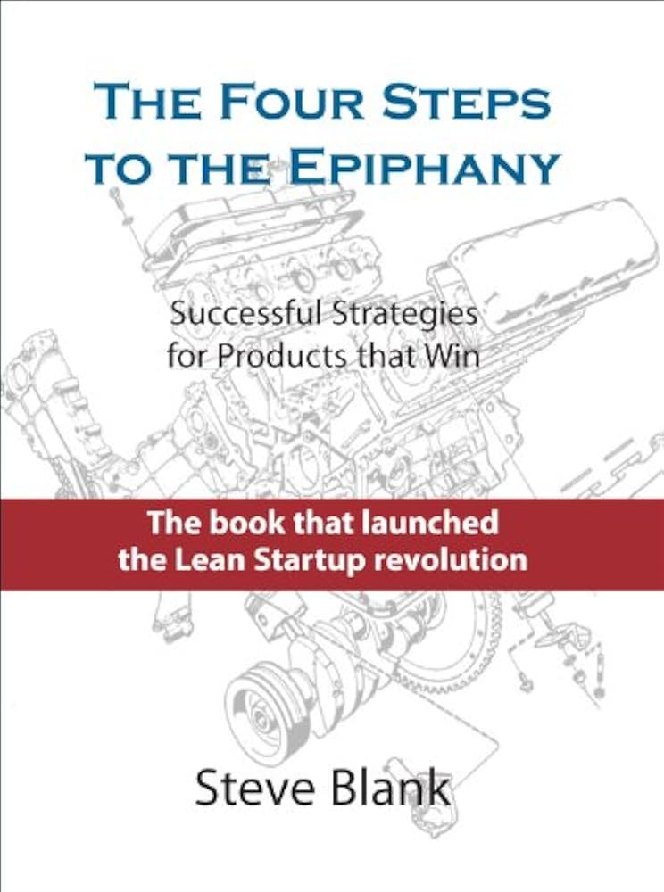<br><sub>The Four Steps to the Epiphany<br>Steve Blank</sub></td>
    <td align="center">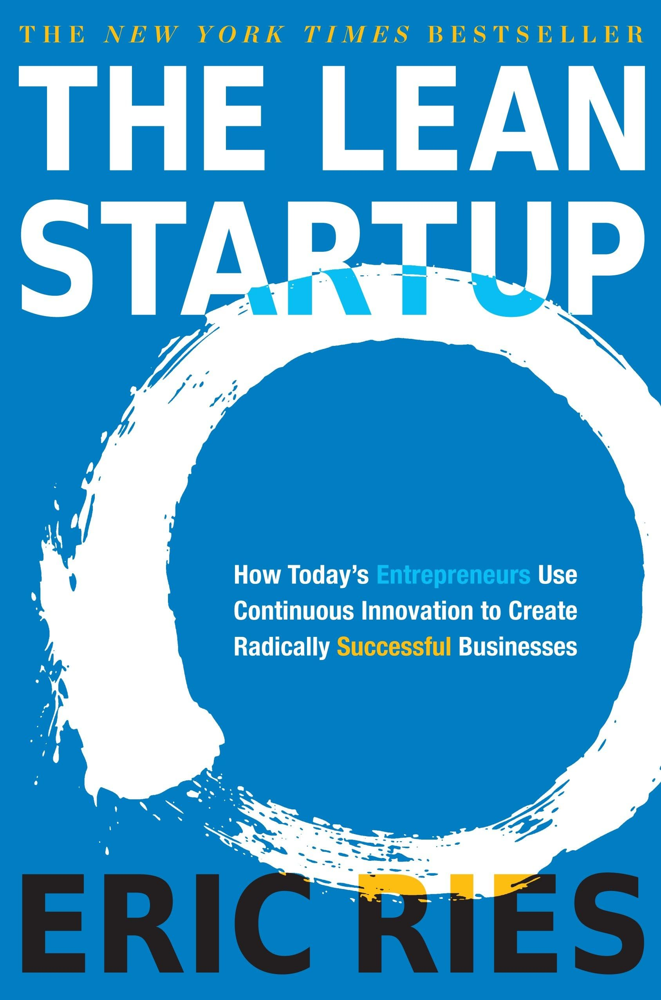<br><sub>The Lean Startup<br>Eric Ries</sub></td>
    <td align="center">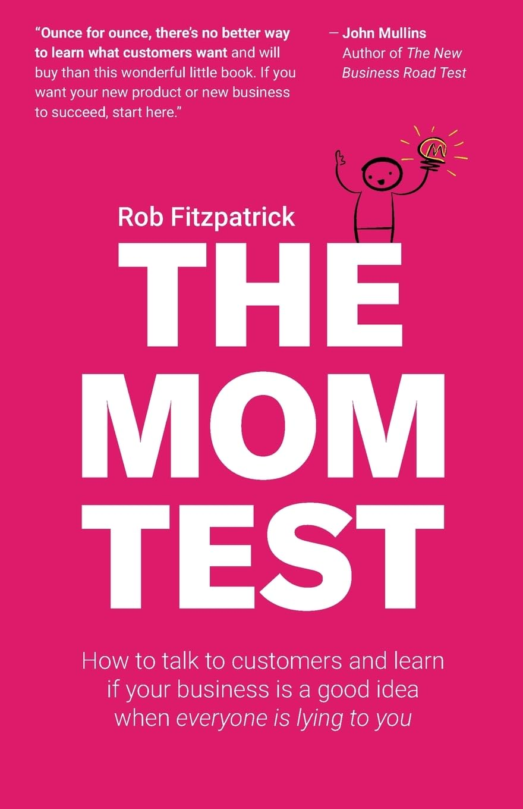<br><sub>The Mom Test<br>Rob Fitzpatrick</sub></td>
    <td align="center">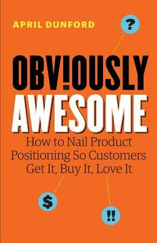<br><sub>Obviously Awesome<br>April Dunford</sub></td>
  </tr>
  <tr>
    <td align="center">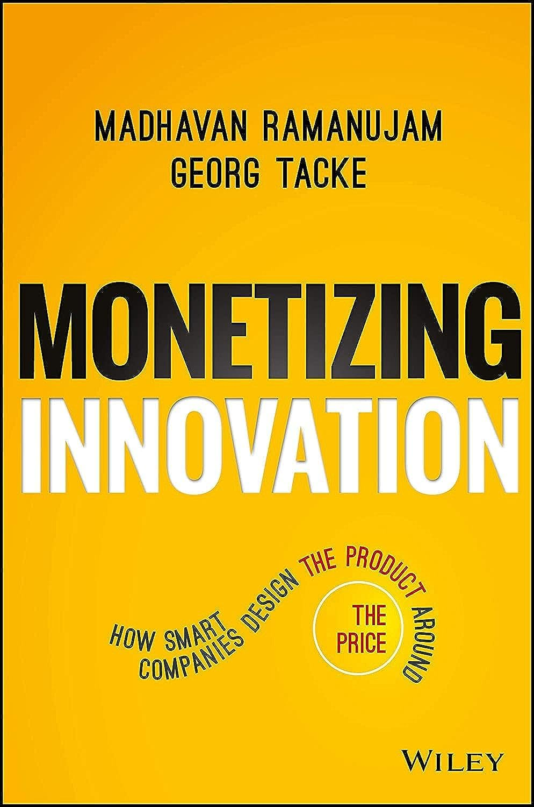<br><sub>Monetizing Innovation<br>Ramanujam & Tacke</sub></td>
    <td align="center">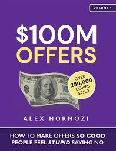<br><sub>$100M Offers<br>Alex Hormozi</sub></td>
    <td align="center">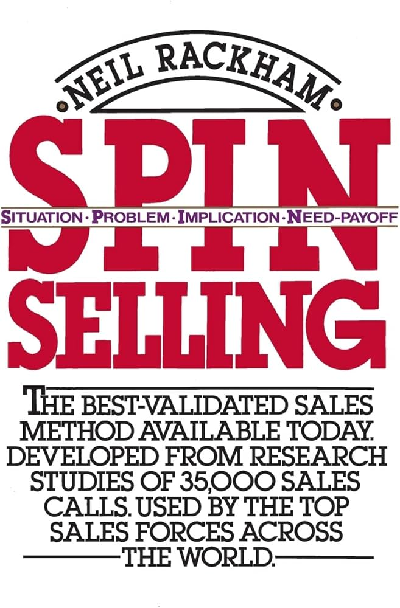<br><sub>SPIN Selling<br>Neil Rackham</sub></td>
    <td align="center">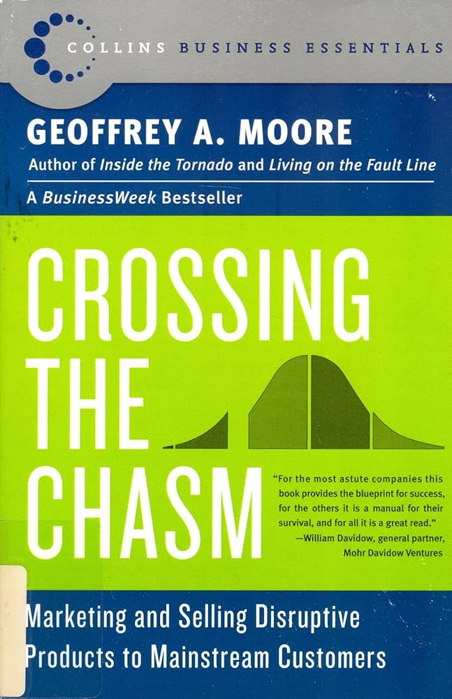<br><sub>Crossing the Chasm<br>Geoffrey Moore</sub></td>
  </tr>
  <tr>
    <td align="center">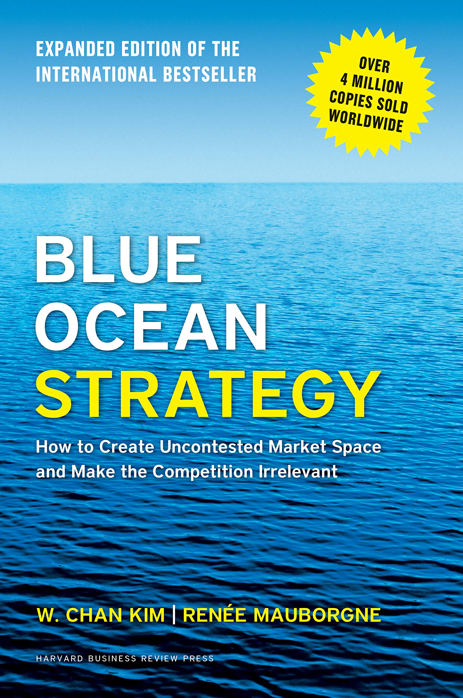<br><sub>Blue Ocean Strategy<br>Kim & Mauborgne</sub></td>
    <td align="center">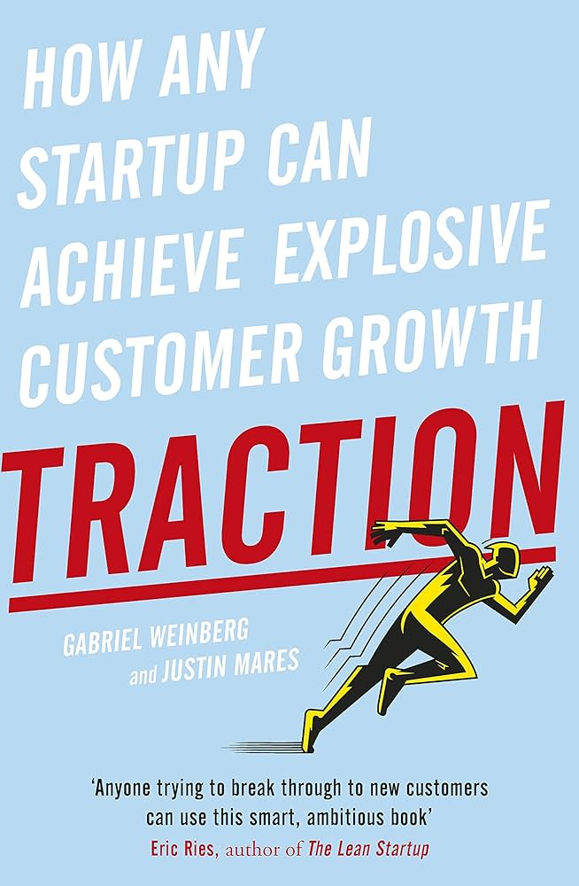<br><sub>Traction<br>Weinberg & Mares</sub></td>
    <td align="center">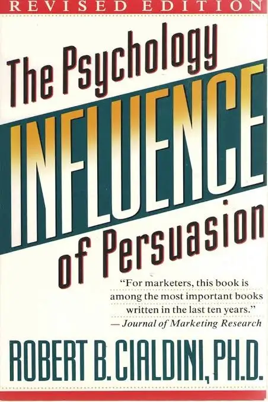<br><sub>Influence<br>Robert Cialdini</sub></td>
    <td align="center">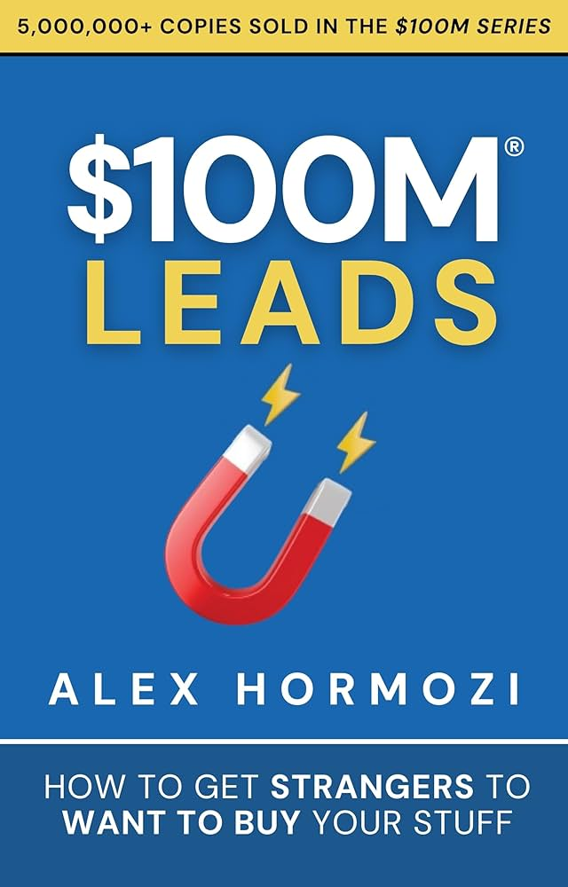<br><sub>$100M Leads<br>Alex Hormozi</sub></td>
  </tr>
  <tr>
    <td align="center">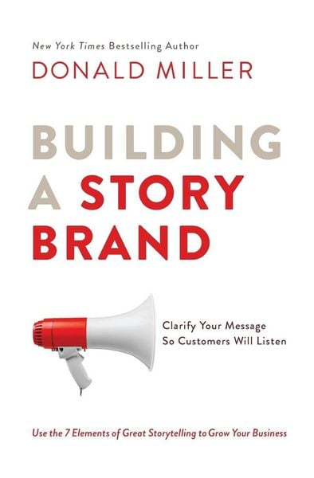<br><sub>Building a StoryBrand<br>Donald Miller</sub></td>
    <td align="center">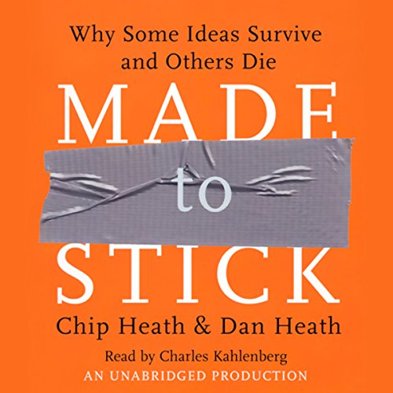<br><sub>Made to Stick<br>Chip & Dan Heath</sub></td>
    <td></td>
    <td></td>
  </tr>
</table>

## Support the Authors

These skills are study aids and critical commentary - they help you apply what the books teach, not replace reading them. The frameworks hit different when you have the full context, the stories, and the author's voice behind them. If a skill helps you, buy the book.

| Book | Author | Get It |
|------|--------|--------|
| The Four Steps to the Epiphany | Steve Blank | [Amazon](https://www.amazon.com/Four-Steps-Epiphany-Steve-Blank/dp/0989200507) |
| The Lean Startup | Eric Ries | [Amazon](https://www.amazon.com/Lean-Startup-Entrepreneurs-Continuous-Innovation/dp/0307887898) |
| The Mom Test | Rob Fitzpatrick | [Amazon](https://www.amazon.com/Mom-Test-customers-business-everyone/dp/1492180742) |
| Obviously Awesome | April Dunford | [Amazon](https://www.amazon.com/Obviously-Awesome-Product-Positioning-Customers/dp/1999023005) |
| Crossing the Chasm | Geoffrey Moore | [Amazon](https://www.amazon.com/Crossing-Chasm-3rd-Disruptive-Mainstream/dp/0062292986) |
| Blue Ocean Strategy | W. Chan Kim & Renee Mauborgne | [Amazon](https://www.amazon.com/Blue-Ocean-Strategy-Expanded-Uncontested/dp/1625274491) |
| Monetizing Innovation | Madhavan Ramanujam & Georg Tacke | [Amazon](https://www.amazon.com/Monetizing-Innovation-Companies-Design-Product/dp/1119240867) |
| SPIN Selling | Neil Rackham | [Amazon](https://www.amazon.com/SPIN-Selling-Neil-Rackham/dp/0070511136) |
| $100M Offers | Alex Hormozi | [Amazon](https://www.amazon.com/100M-Offers-People-Refuse-ebook/dp/B099QVG1H8) |
| $100M Leads | Alex Hormozi | [Amazon](https://www.amazon.com/100M-Leads-Strangers-Want-ebook/dp/B0CFDR4VT8) |
| Influence | Robert Cialdini | [Amazon](https://www.amazon.com/Influence-New-Expanded-Psychology-Persuasion/dp/0062937650) |
| Traction | Gabriel Weinberg & Justin Mares | [Amazon](https://www.amazon.com/Traction-Startup-Achieve-Explosive-Customer/dp/1591848369) |
| Building a StoryBrand | Donald Miller | [Amazon](https://www.amazon.com/Building-StoryBrand-Clarify-Message-Customers/dp/0718033329) |
| Made to Stick | Chip Heath & Dan Heath | [Amazon](https://www.amazon.com/Made-Stick-Ideas-Survive-Others/dp/1400064287) |

## License

MIT
